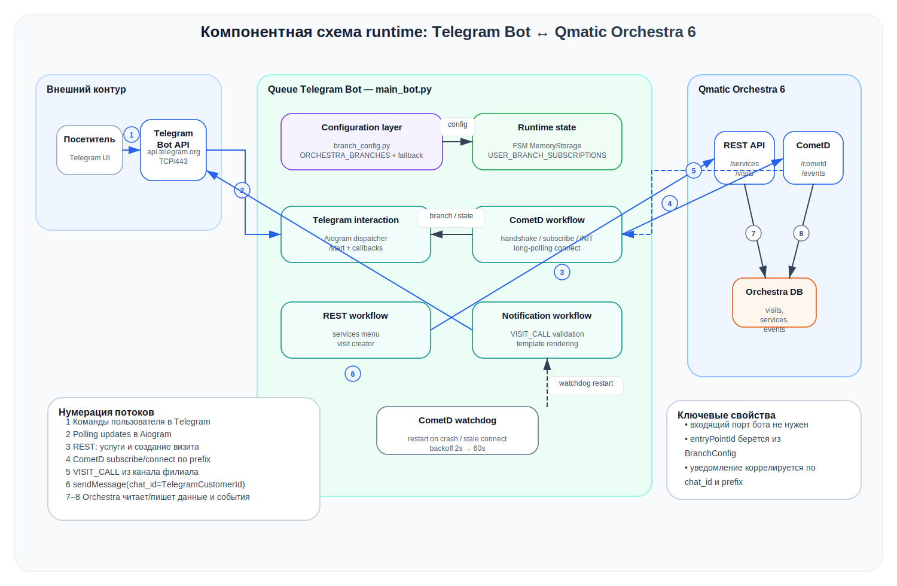
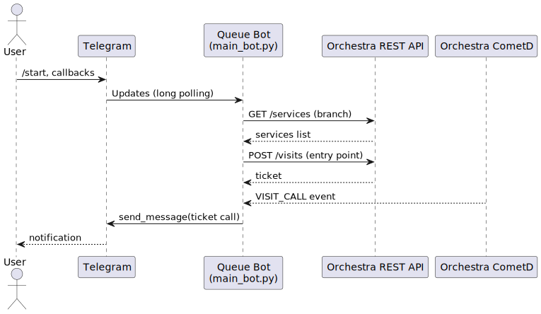
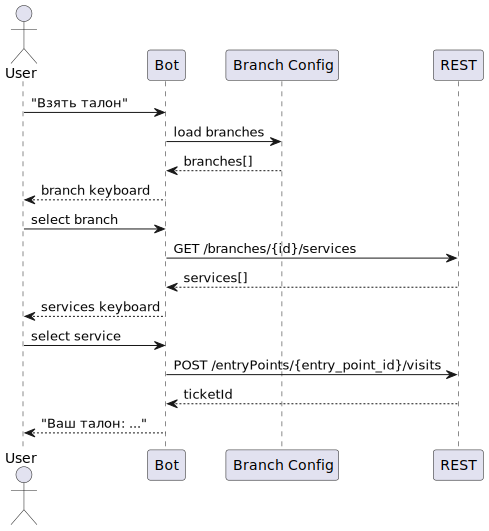

# Queue Telegram Bot (Orchestra + CometD)

[](#требования)
[](#запуск)
[](#тестирование)
[](#лицензия)

Telegram-бот электронной очереди для Orchestra, который помогает клиенту взять талон и получить персональное уведомление о вызове.

---

## Оглавление

- [Возможности](#возможности)
- [Архитектура](#архитектура)
- [Требования](#требования)
- [Быстрый старт](#быстрый-старт)
- [Конфигурация](#конфигурация)
  - [Обязательные переменные](#обязательные-переменные)
  - [Дополнительные переменные](#дополнительные-переменные)
  - [Шаблоны уведомлений](#шаблоны-уведомлений)
- [Режимы работы (single/multi-branch)](#режимы-работы-singlemulti-branch)
  - [Multi-branch (рекомендуется)](#multi-branch-рекомендуется)
  - [Single-branch fallback](#single-branch-fallback-обратная-совместимость)
  - [Мультисервис](#мультисервис-несколько-услуг-в-один-визит)
- [Клиентский путь (`client_path.yml`)](#клиентский-путь-client_pathyml)
- [Запуск](#запуск)
  - [Локально](#локально)
  - [Docker Compose](#docker-compose)
- [Тестирование](#тестирование)
- [Диаграммы](#диаграммы)
- [Безопасность и эксплуатация](#безопасность-и-эксплуатация)
- [Диагностика и частые проблемы](#диагностика-и-частые-проблемы)
- [FAQ](#faq)
- [Лицензия](#лицензия)

---

## Возможности

- Поддержка многофилиального режима и fallback в single-branch конфигурацию.
- Выбор услуг по отделению и создание талона (`visit`) в корректный `entryPoint`.
- Подписка на CometD-события по префиксам филиалов.
- Персональные уведомления при событии `VISIT_CALL` только соответствующему пользователю.
- Гибкие шаблоны уведомлений (глобальные и по филиалам).

> Основной runtime-файл: `main_bot.py`.

## Архитектура

Бот использует polling Telegram API, REST-взаимодействие с Orchestra для выдачи талонов и CometD-подписку для получения событий о вызове. Состояние пользователя и маршрутизация уведомлений строятся вокруг связи Telegram-пользователя и созданного талона.

## Требования

- Python 3.11+
- Доступ к Telegram Bot API
- Доступ к Orchestra (REST + CometD)
- (Опционально) Docker и Docker Compose

## Быстрый старт

```bash
pip install -r requirements.txt
cp .env.example .env
# заполните .env
python main_bot.py
```

Минимально нужны: `API_TOKEN`, `ORCHESTRA_URL`, `ORCHESTRA_LOGIN`, `ORCHESTRA_PASSWORD`.

## Конфигурация

### Обязательные переменные

| Переменная | Назначение |
|---|---|
| `API_TOKEN` | Токен Telegram-бота |
| `ORCHESTRA_URL` | Базовый URL Orchestra |
| `ORCHESTRA_LOGIN` | Логин Orchestra |
| `ORCHESTRA_PASSWORD` | Пароль Orchestra |

### Дополнительные переменные

| Переменная | Назначение | Значение по умолчанию |
|---|---|---|
| `SERVICE_BLACKLIST` | Услуги, скрытые в меню (через запятую) | `Оплата услуг` |
| `VISIT_CALL_TEMPLATE` | Общий шаблон уведомления о вызове | `Уважаемый клиент! ...` |
| `ORCHESTRA_BRANCH_VISIT_CALL_TEMPLATES` | JSON-переопределения шаблонов по `branchId`/`prefix` | пусто |
| `ORCHESTRA_MULTI_SERVICE_ENABLED` | Включить выбор нескольких услуг (`true/false`) | `false` |
| `ORCHESTRA_BRANCH_MULTI_SERVICE_ENABLED` | JSON-переопределения мультисервиса по `branchId`/`prefix` | пусто |
| `LOG_LEVEL` | Уровень логирования Python (`DEBUG/INFO/WARNING/ERROR/CRITICAL`) | `INFO` |

### Шаблоны уведомлений

Поддерживаются плейсхолдеры Python `str.format` из полей `prm` события `VISIT_CALL`, например:

- `{ticketId}`
- `{ticket}`
- `{servicePointId}`
- `{servicePointName}`
- `{branchName}`
- `{waitingTime}`
- `{TelegramCustomerFullName}`

Пример:

```env
VISIT_CALL_TEMPLATE=Клиент {ticketId}, пройдите к рабочему месту {servicePointId}
ORCHESTRA_BRANCH_VISIT_CALL_TEMPLATES={"6":"Нотариус: талон {ticketId}, окно {servicePointName}","SVR":"Северный филиал: {ticket} -> {servicePointId}"}
```

Персональные поля (например, `{TelegramCustomerFullName}`) безопасно использовать в шаблонах: при логировании значения маскируются (`***`).

## Режимы работы (single/multi-branch)

### Multi-branch (рекомендуется)

Настраивается через `ORCHESTRA_BRANCHES` (JSON-массив):

```json
[
  {"id": 6, "name": "Центральное отделение", "prefix": "NTR", "entry_point_id": 2},
  {"id": 7, "name": "Северное отделение", "prefix": "SVR", "entry_point_id": 3}
]
```

Поля:

- `id` — `branchId` в Orchestra
- `name` — отображаемое имя кнопки в Telegram
- `prefix` — префикс CometD-канала (`/events/{prefix}/QVoiceLight`)
- `entry_point_id` — `entryPointId` для создания талона в этом отделении

### Single-branch fallback (обратная совместимость)

Если `ORCHESTRA_BRANCHES` не задан, используется старый набор:

- `BRANCH_ID`
- `ORCHESTRA_ENTRY_POINT_ID`
- `ORCHESTRA_BRANCH_CODE`
- `ORCHESTRA_BRANCH_NAME` (опционально)

> Если `ORCHESTRA_BRANCHES` задан, fallback-переменные игнорируются.

### Мультисервис (несколько услуг в один визит)

```env
ORCHESTRA_MULTI_SERVICE_ENABLED=true
ORCHESTRA_BRANCH_MULTI_SERVICE_ENABLED={"6":true,"SVR":false}
```

Приоритет флагов:

1. Значение для отделения в `ORCHESTRA_BRANCH_MULTI_SERVICE_ENABLED`
2. Иначе глобальный `ORCHESTRA_MULTI_SERVICE_ENABLED`
3. Если оба отсутствуют — выключено

## Клиентский путь (`client_path.yml`)

Файл `client_path.yml` позволяет настроить опрос клиента по шагам и привязать ответы к услугам.

Ключевые поля в `options`:

- `next_question_id` — переход к следующему вопросу (талон на этом шаге не создается).
- `services` — список ID услуг (числа).
- `service_names` — список названий услуг (маппинг по имени услуги из Orchestra).
- `multi_services_action` — режим обработки ответа, если он соответствует нескольким услугам:
  - `auto` — создать визит сразу со всеми услугами;
  - `choose` — показать найденные услуги и попросить выбрать одну;
  - `choose_many` — показать найденные услуги, позволить выбрать несколько и нажать подтверждение.

Если `multi_services_action` не задан, используется значение `choose`.

Пример:

```yaml
options:
  - text: "Новый кредит"
    service_names: ["Кредиты", "Страхование"]
    multi_services_action: choose_many
  - text: "Сделка с недвижимостью"
    service_names: ["Сделки", "Заверение документов"]
    multi_services_action: auto
```

## Запуск

### Локально

```bash
pip install -r requirements.txt
export API_TOKEN="..."
export ORCHESTRA_URL="http://...:8080/"
export ORCHESTRA_LOGIN="..."
export ORCHESTRA_PASSWORD="..."
export ORCHESTRA_BRANCHES='[{"id":6,"name":"Центральное","prefix":"NTR","entry_point_id":2}]'
python main_bot.py
```

### Docker Compose

```bash
cp .env.example .env
# заполните .env (особенно API_TOKEN и ORCHESTRA_BRANCHES)
docker compose up -d --build
docker compose logs -f queue-bot
```

## Тестирование

```bash
pytest -q
```

Тесты покрывают парсинг и валидацию многофилиальной конфигурации (`ORCHESTRA_BRANCHES`) в `branch_config.py`.

## Диаграммы

Диаграммы поддерживаются в двух форматах:

- PlantUML-исходники: `docs/diagrams/src/*.puml`
- SVG для документации: `docs/diagrams/*.svg`

| Диаграмма | PlantUML | SVG |
|---|---|---|
| Runtime-компоненты бота | `docs/diagrams/src/runtime-overview.puml` | `docs/diagrams/runtime-overview.svg` |
| Сетевое размещение и ACL/FW | `docs/diagrams/src/network-flow.puml` | `docs/diagrams/network-flow.svg` |
| Получение талона и уведомление | `docs/diagrams/src/ticket-sequence.puml` | `docs/diagrams/ticket-sequence.svg` |
| CometD lifecycle и восстановление | `docs/diagrams/src/cometd-sequence.puml` | `docs/diagrams/cometd-sequence.svg` |





## Безопасность и эксплуатация

- Не публикуйте входящие порты контейнера бота наружу.
- Используйте polling (без публичного webhook).
- Разрешайте только необходимый исходящий доступ:
  - `api.telegram.org:443`
  - внутренние endpoint Orchestra (REST + CometD)
- Не открывайте прямой внешний доступ к БД Orchestra.
- Храните секреты (`API_TOKEN`, `ORCHESTRA_PASSWORD`) в secret-store/vault или защищённом `.env`.
- Администрирование выполняйте через VPN / jump host / контролируемый админ-контур.

## Диагностика и частые проблемы

### Бот не показывает отделения

Проверьте:

- валиден ли JSON в `ORCHESTRA_BRANCHES`
- есть ли у каждого отделения `id`, `name`, `prefix`, `entry_point_id`

### Не создаётся талон

Проверьте:

- корректность `ORCHESTRA_URL`
- валидность `ORCHESTRA_LOGIN` / `ORCHESTRA_PASSWORD`
- существование `entry_point_id` в Orchestra

### Нет уведомлений о вызове

Проверьте:

- доступность CometD endpoint из окружения бота
- корректность `prefix` у отделений
- что событие действительно `VISIT_CALL`
- что `TelegramCustomerId` в событии соответствует пользователю

### Полезные команды

```bash
# логи контейнера
docker compose logs -f queue-bot

# запуск тестов
pytest -q
```

## FAQ

### Можно ли использовать только одно отделение?

Да. Если не задавать `ORCHESTRA_BRANCHES`, бот работает в fallback-режиме через переменные single-branch конфигурации.

### Что приоритетнее: шаблон по филиалу или общий?

Сначала применяется шаблон филиала из `ORCHESTRA_BRANCH_VISIT_CALL_TEMPLATES`, затем общий `VISIT_CALL_TEMPLATE`.

## Лицензия

Проект распространяется по внутренней политике вашей организации. При необходимости добавьте явный файл `LICENSE`.
