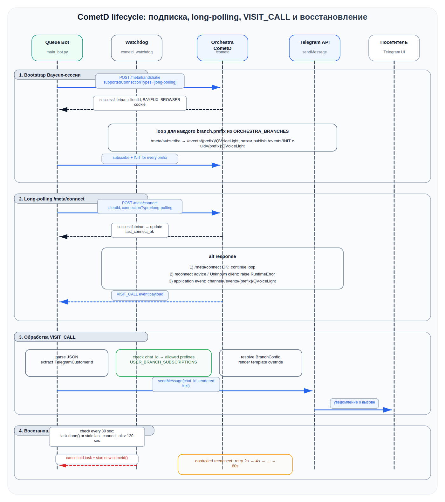

# Queue Telegram Bot (Orchestra + CometD)

Бот для Telegram, который:
- показывает список отделений;
- после выбора отделения показывает услуги;
- создаёт талон (visit) в правильный `entryPoint` выбранного отделения;
- подписывается на CometD события по префиксам отделений;
- уведомляет клиента о вызове талона (`VISIT_CALL`) только для отделения, где клиент получил талон.

Основной runtime-файл: `main_bot.py`.

---

## 1. Конфигурация

### 1.1 Обязательные параметры

| Переменная | Назначение |
|---|---|
| `API_TOKEN` | Токен Telegram-бота |
| `ORCHESTRA_URL` | Базовый URL Orchestra |
| `ORCHESTRA_LOGIN` | Логин Orchestra |
| `ORCHESTRA_PASSWORD` | Пароль Orchestra |

### 1.2 Многофилиальный режим

Настраивается через `ORCHESTRA_BRANCHES` (JSON-массив):

```json
[
  {"id": 6, "name": "Центральное отделение", "prefix": "NTR", "entry_point_id": 2},
  {"id": 7, "name": "Северное отделение", "prefix": "SVR", "entry_point_id": 3}
]
```

Поля:
- `id` — ID отделения (`branchId`) в Orchestra;
- `name` — отображаемое имя в Telegram-меню;
- `prefix` — префикс CometD канала (`/events/{prefix}/QVoiceLight`);
- `entry_point_id` — ID точки входа для выдачи талона в этом отделении.

### 1.3 Обратная совместимость (однофилиальный режим)

Если `ORCHESTRA_BRANCHES` не задан, используется fallback:
- `BRANCH_ID`
- `ORCHESTRA_ENTRY_POINT_ID`
- `ORCHESTRA_BRANCH_CODE`
- `ORCHESTRA_BRANCH_NAME` (необязательный, название кнопки отделения)

### 1.4 Дополнительные параметры

| Переменная | Назначение | По умолчанию |
|---|---|---|
| `SERVICE_BLACKLIST` | Услуги, скрытые в меню (через запятую) | `Оплата услуг` |
| `VISIT_CALL_TEMPLATE` | Общий шаблон текста вызова посетителя для всех филиалов | `Уважаемый клиент! ...` |
| `ORCHESTRA_BRANCH_VISIT_CALL_TEMPLATES` | JSON-объект переопределений шаблона по `branchId` или `prefix` | пусто |
| `ORCHESTRA_MULTI_SERVICE_ENABLED` | Включить множественный выбор услуг для всех отделений (`true/false`) | `false` |
| `ORCHESTRA_BRANCH_MULTI_SERVICE_ENABLED` | JSON-объект переопределений для отделений по `branchId` или `prefix` | пусто |
| `LOG_LEVEL` | Уровень логирования Python (`DEBUG/INFO/WARNING/ERROR/CRITICAL`) | `INFO` |

Шаблоны поддерживают плейсхолдеры Python `str.format` из полей `prm` события `VISIT_CALL`, например:
- `{ticketId}`, `{ticket}`, `{servicePointId}`, `{servicePointName}`, `{branchName}`, `{waitingTime}`, `{TelegramCustomerFullName}`.

Для шаблонов приветствия/вызова можно безопасно использовать персональные поля посетителя (например, `{TelegramCustomerFullName}`): при логировании события значения персональных полей маскируются (`***`) и не попадают в логи в открытом виде.

Примеры:

```env
# один шаблон на все филиалы
VISIT_CALL_TEMPLATE=Клиент {ticketId}, пройдите к рабочему месту {servicePointId}

# отдельные шаблоны по branchId/prefix
ORCHESTRA_BRANCH_VISIT_CALL_TEMPLATES={"6":"Нотариус: талон {ticketId}, окно {servicePointName}","SVR":"Северный филиал: {ticket} -> {servicePointId}"}
```

---


### 1.5 Множественный выбор услуг

Можно включить выбор нескольких услуг при создании одного визита:

```env
# глобально для всех отделений
ORCHESTRA_MULTI_SERVICE_ENABLED=true

# точечно для отделений (перекрывает глобальное значение)
ORCHESTRA_BRANCH_MULTI_SERVICE_ENABLED={"6":true,"SVR":false}
```

Логика приоритета:
- если для отделения найдено значение в `ORCHESTRA_BRANCH_MULTI_SERVICE_ENABLED`, используется оно;
- иначе используется `ORCHESTRA_MULTI_SERVICE_ENABLED`;
- если оба параметра отсутствуют, множественный выбор выключен.

В Telegram при включении режима можно отметить несколько услуг и нажать кнопку «Подтвердить выбор».

---

### 1.6 Пример `.env` для нескольких филиалов

```env
API_TOKEN=...
ORCHESTRA_URL=http://127.0.0.1:8080/
ORCHESTRA_LOGIN=superadmin
ORCHESTRA_PASSWORD=ulan
ORCHESTRA_BRANCHES=[{"id":6,"name":"Центральное отделение","prefix":"NTR","entry_point_id":2},{"id":7,"name":"Северное отделение","prefix":"SVR","entry_point_id":3},{"id":8,"name":"Южное отделение","prefix":"UG","entry_point_id":4}]
SERVICE_BLACKLIST=Оплата услуг

# Простой вариант: мультисервис включен везде
ORCHESTRA_MULTI_SERVICE_ENABLED=true

# Вариант для разных отделений (перекрывает глобальный флаг)
# Центральное (id=6) - включено
# Северное (prefix=SVR) - выключено
# Южное (id=8) - включено
ORCHESTRA_BRANCH_MULTI_SERVICE_ENABLED={"6":true,"SVR":false,"8":true}
```

Если `ORCHESTRA_BRANCHES` задан, бот полностью работает в многофилиальном режиме и fallback-переменные (`BRANCH_ID`, `ORCHESTRA_ENTRY_POINT_ID`, `ORCHESTRA_BRANCH_CODE`) не используются.

---

## 2. Поведение бота

1. Пользователь отправляет `/start`.
2. Нажимает «Взять талон».
3. Выбирает отделение.
4. Выбирает услугу.
5. Получает номер талона.
6. При `VISIT_CALL` в выбранном отделении получает уведомление.

---

## 3. Запуск

### 3.1 Локально

```bash
pip install -r requirements.txt
export API_TOKEN="..."
export ORCHESTRA_URL="http://...:8080/"
export ORCHESTRA_LOGIN="..."
export ORCHESTRA_PASSWORD="..."
export ORCHESTRA_BRANCHES='[{"id":6,"name":"Центральное","prefix":"NTR","entry_point_id":2}]'
python main_bot.py
```

### 3.2 Docker Compose

```bash
cp .env.example .env
# заполните .env (особенно API_TOKEN и ORCHESTRA_BRANCHES)
docker compose up -d --build
docker compose logs -f queue-bot
```

---

## 4. Тесты

```bash
pytest -q
```

Тесты покрывают парсинг и валидацию многофилиальной конфигурации (`ORCHESTRA_BRANCHES`) в `branch_config.py`.

---

## 5. Архитектура и UML-диаграммы

Диаграммы вынесены в отдельный каталог и поддерживаются в двух формах:

- исходники PlantUML: `docs/diagrams/src/*.puml`;
- визуализированные SVG для README: `docs/diagrams/*.svg`.

Единый стиль диаграмм задан в `docs/diagrams/src/style.iuml`: светлая деловая палитра, аккуратные зоны ответственности, минимизация пересечений стрелок, единая типографика и отдельное выделение внешнего контура, runtime-компонентов, сервисов Orchestra и data-zone.

| Диаграмма | Исходник PlantUML | SVG |
|---|---|---|
| Runtime-компоненты бота | `docs/diagrams/src/runtime-overview.puml` | `docs/diagrams/runtime-overview.svg` |
| Сетевое размещение и ACL/FW | `docs/diagrams/src/network-flow.puml` | `docs/diagrams/network-flow.svg` |
| Получение талона и уведомление | `docs/diagrams/src/ticket-sequence.puml` | `docs/diagrams/ticket-sequence.svg` |
| CometD lifecycle и восстановление | `docs/diagrams/src/cometd-sequence.puml` | `docs/diagrams/cometd-sequence.svg` |

### 5.1 Runtime-компоненты бота

Диаграмма показывает фактическую структуру `main_bot.py` и связанных модулей:

- `branch_config.py` загружает `ORCHESTRA_BRANCHES` или включает однофилиальный fallback;
- `Aiogram dispatcher` обрабатывает `/start`, callback-кнопки и FSM-состояния;
- REST workflow получает услуги и создаёт визит в `entryPoint` выбранного филиала;
- CometD workflow подписывается на `/events/{prefix}/QVoiceLight` по каждому филиалу;
- `USER_BRANCH_SUBSCRIPTIONS` связывает `chat_id` пользователя с prefix филиала;
- notification workflow валидирует `VISIT_CALL` и рендерит текст через глобальный или филиальный шаблон.


### 5.2 Сетевая схема размещения и доступов

Целевой вариант размещения: бот находится внутри корпоративного или филиального контура, не публикует входящий порт наружу и работает через Telegram polling. Доступ в Интернет нужен только исходящий — к `api.telegram.org:443`.


#### 5.2.1 Матрица сетевых доступов

| Источник | Назначение | Протокол/порт | Направление | Назначение потока | Политика |
|---|---|---:|---|---|---|
| Queue Telegram Bot | `api.telegram.org` | TCP 443 / HTTPS | EGRESS | `getUpdates`, `sendMessage` | **ALLOW** |
| Queue Telegram Bot | Orchestra REST API | TCP 443 или внутренний HTTP-порт | EGRESS | получение услуг, создание визита | **ALLOW** |
| Queue Telegram Bot | Orchestra CometD endpoint | TCP 443 или порт Bayeux/CometD | EGRESS | `handshake`, `subscribe`, `INIT`, `connect` | **ALLOW** |
| Orchestra REST / CometD | Orchestra DB | внутренний DB-порт | EAST-WEST | чтение/запись бизнес-данных и событий | **ALLOW внутри private zone** |
| Интернет | Queue Telegram Bot | любой | INGRESS | не требуется, webhook не используется | **DENY** |
| Интернет | Orchestra REST / CometD | любой | INGRESS | внешний доступ не требуется | **DENY** |
| Интернет | Orchestra DB | любой | INGRESS | прямой доступ к БД недопустим | **DENY** |

#### 5.2.2 Практические требования к размещению

- Не публиковать `ports:` у контейнера бота наружу.
- Не выдавать боту публичный IP без необходимости.
- Разрешить исходящий HTTPS к `api.telegram.org`.
- Разрешить боту доступ к внутренним endpoint Orchestra REST и CometD.
- Закрыть БД Orchestra от любых внешних сетей.
- Администрирование выполнять через VPN, jump host или иной контролируемый административный контур.
- Секреты (`API_TOKEN`, `ORCHESTRA_PASSWORD`) хранить в secret-store/vault или в защищённом `.env`, не коммитить в открытый репозиторий.

### 5.3 Последовательность получения талона и уведомления

Диаграмма описывает основной бизнес-сценарий: пользователь выбирает действие, филиал и услугу, бот создаёт визит в Orchestra, сохраняет связь пользователя с prefix филиала и затем отправляет персональное уведомление при событии `VISIT_CALL`.


Ключевые точки сценария:

- В многофилиальном режиме пользователь сначала выбирает отделение, затем услугу.
- В однофилиальном режиме отделение выбирается автоматически через fallback-конфигурацию.
- При создании визита endpoint использует `entryPointId` из `BranchConfig`.
- В параметры визита передаются `TelegramCustomerId` и `TelegramCustomerFullName`.
- После успешного создания визита бот сохраняет `chat_id -> branch prefix` в `USER_BRANCH_SUBSCRIPTIONS`.
- Уведомление по `VISIT_CALL` отправляется только пользователю, чей `TelegramCustomerId` пришёл в событии.

### 5.4 CometD lifecycle и восстановление

Диаграмма отражает жизненный цикл CometD-сессии в текущей реализации:

- `POST /meta/handshake` получает `clientId` и cookie `BAYEUX_BROWSER`;
- для каждого `branch.prefix` выполняется `POST /meta/subscribe` на `/events/{prefix}/QVoiceLight`;
- после подписки публикуется `INIT` в `/events/INIT`;
- основной цикл работает через long-polling `POST /meta/connect`;
- при `VISIT_CALL` бот извлекает `prm.TelegramCustomerId`, проверяет филиальный prefix и отправляет сообщение в Telegram;
- `cometd_watchdog` перезапускает задачу при падении или отсутствии успешного `/meta/connect` дольше контрольного интервала.



### 5.5 Правила сопровождения диаграмм

- `docs/diagrams/src/*.puml` считать источником правды.
- `docs/diagrams/*.svg` обновлять при каждом изменении соответствующего `.puml`.
- При изменении REST endpoint, CometD lifecycle, multi-branch логики, шаблонов уведомлений или правил сетевого размещения синхронно обновлять PlantUML-исходник, SVG и пояснение в README.
- Для повторной генерации SVG можно использовать локальный PlantUML с Graphviz, например:

```bash
plantuml -tsvg -o .. docs/diagrams/src/*.puml
```

Если PlantUML запускается из другого каталога, учитывайте относительное подключение `!include style.iuml`.
